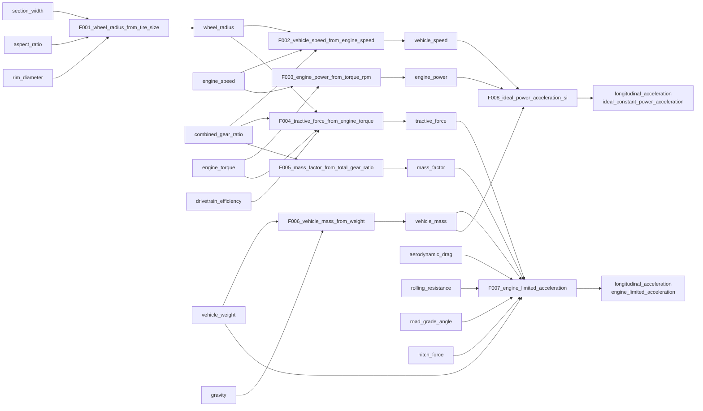

# DEPENDENCIES.generated.md

> Auto-generated from `data/formulas.v0.1.json` and `data/recommendations.v0.1.json`.

**Authority rule:** structured JSON and the dependency table below are authoritative. Diagrams are illustrative only and must not be parsed as machine definitions.

- Graph type: DAG
- Maximum current formula depth: **3**
- Configured reverse-search limit: **5** formula nodes

## Formula dependency table

| formula_id | required_inputs | output | model_name |
| --- | --- | --- | --- |
| F001_wheel_radius_from_tire_size | section_width, aspect_ratio, rim_diameter | wheel_radius | tire_size_radius_model |
| F002_vehicle_speed_from_engine_speed | wheel_radius, engine_speed, combined_gear_ratio | vehicle_speed | powertrain_speed_relation |
| F003_engine_power_from_torque_rpm | engine_torque, engine_speed | engine_power | engine_power_calculation |
| F004_tractive_force_from_engine_torque | engine_torque, combined_gear_ratio, drivetrain_efficiency, wheel_radius | tractive_force | engine_tractive_force_at_wheels |
| F005_mass_factor_from_total_gear_ratio | combined_gear_ratio | mass_factor | mass_factor_approximation |
| F006_vehicle_mass_from_weight | vehicle_weight, gravity | vehicle_mass | weight_to_mass_relation |
| F007_engine_limited_acceleration | tractive_force, aerodynamic_drag, rolling_resistance, vehicle_weight, road_grade_angle, hitch_force, mass_factor, vehicle_mass | longitudinal_acceleration | engine_limited_acceleration |
| F008_ideal_power_acceleration_si | engine_power, vehicle_speed, vehicle_mass | longitudinal_acceleration | ideal_constant_power_acceleration |

## Generated Mermaid diagram

## Recommendation relation

`R001_longitudinal_acceleration_recommended_model` selects `engine_limited_acceleration` as the default Active model when F007 satisfies its applicability, input, constraint, and computability requirements. It does not calculate a numerical value.

## Invalidation rule

Stale propagation follows the actual runtime `formula_path` and dependency instances. It must not invalidate all results merely because they share a `variable_id`.
